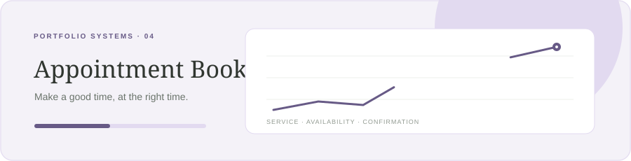

<div align="center">



# Slotwise — Appointment Booking

**Make a good time, at the right time.**

[](https://nextjs.org/)
[](https://react.dev/)
[](https://www.typescriptlang.org/)
[](LICENSE)

</div>

## Product scope

Slotwise gives a small service studio a calendar view for bookings and a progressive flow for choosing a service, time, and guest. It makes timezone context visible throughout the decision.

## Current release

The interactive demo includes a weekly calendar, service and booking filters, booking creation, overlap checks against existing appointments, and cancellation. Demo records persist in the current browser with `localStorage`. Availability, email delivery, payment, and timezone conversion are not backed by a server yet; use sample data only.

## Run locally

```bash
npm install
npm run dev
```

Open [http://localhost:3000](http://localhost:3000).

## Planned production architecture

- Supabase Auth and workspace-scoped services, availability, resources, and booking records.
- Store timestamps as `timestamptz`; calculate openings with an IANA timezone on the server.
- A Postgres exclusion constraint prevents two confirmed bookings from overlapping a resource.
- Idempotent reservation endpoints handle retries and concurrent slot selection.
- Resend sends confirmations, cancellations, and reminders from server-side jobs.
- Vercel preview deployments validate the booking flow before release.

## Data model sketch

`services(id, workspace_id, duration_minutes, buffer_minutes, price)`

`availability_rules(id, resource_id, weekday, local_start, local_end, timezone)`

`bookings(id, workspace_id, resource_id, service_id, starts_at, ends_at, status, idempotency_key)`

An initial RLS and overlap-constraint migration is in `supabase/migrations/`.

## Stack

Next.js App Router · React · TypeScript · Supabase (planned integration) · Resend (planned integration) · Vercel

## License

MIT. See [LICENSE](LICENSE).

